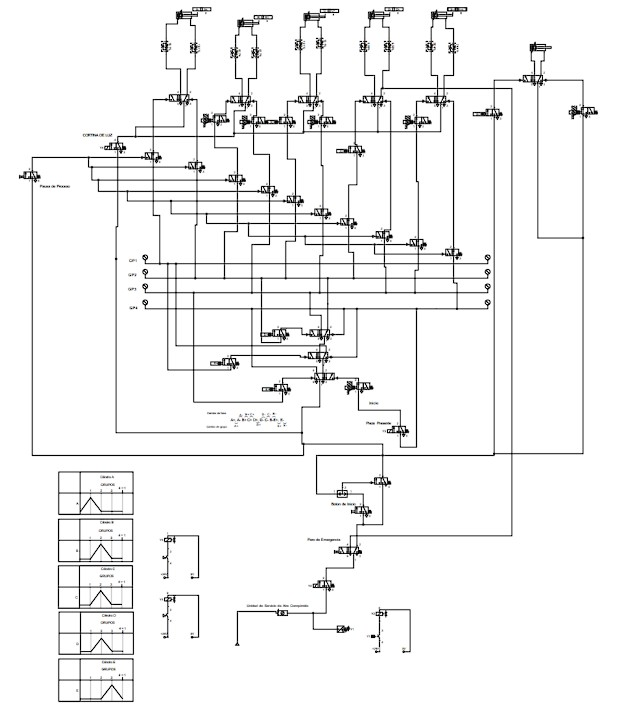
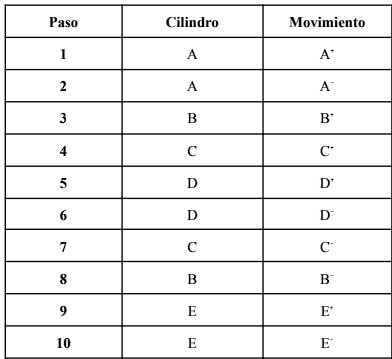
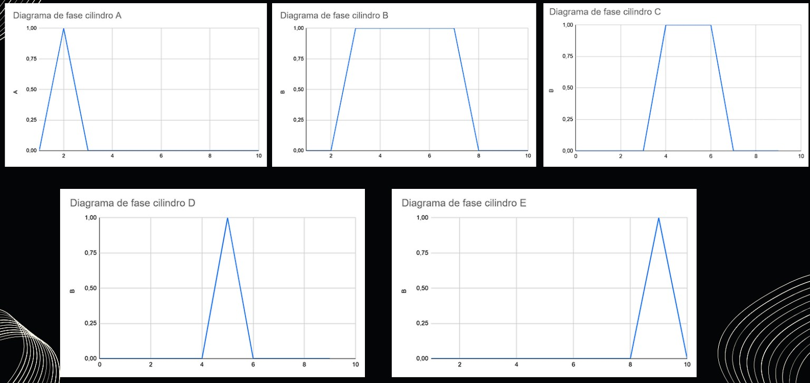
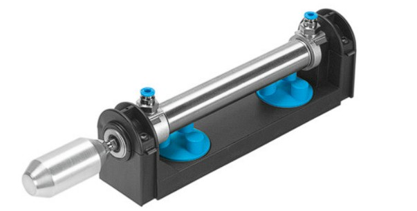

# Automated Electro-Pneumatic Machining Cell (Cascade Method)

Design, simulation, and implementation of an automated electro-pneumatic system to simulate an industrial machining, manipulation, and transfer process. Using the cascade method, a control logic sequence coordinates five double-acting cylinders to process a 67.875 kg aluminum part. The system strictly integrates ISO and IEC safety standards, featuring light curtains, emergency stops, and safe-start conditions.

## System Overview

The system operates under a fully automated cycle that initiates only when all initial safety and positioning conditions are met simultaneously: the actuation of the start button, the detection of raw material in the initial position, an adequate pneumatic pressure level (6 bar), the correct enabling of the light curtain, and the confirmation that all cylinders are in their home position.

Once the start is validated, the sequential process executes as follows:

1. **Raw Material Feeding:** Cylinder A extends and retracts ($A^{+}$ / $A^{-}$) to push the raw material into the main workstation.
2. **Vertical Clamping:** Cylinder B extends ($B^{+}$), lowering a plate to firmly clamp the aluminum part against a rigid base, preventing any displacement during machining.
3. **Part Orientation:** Cylinder C extends ($C^{+}$), converting its linear motion into rotation via a rack and pinion mechanism to rotate the part exactly 90° on its axis.
4. **Drilling Operation:** Cylinder D extends and retracts ($D^{+}$ / $D^{-}$) vertically to simulate the active drilling tool on the aluminum block.
5. **Return and Release:** Cylinder C retracts ($C^{-}$) to return the part to its original orientation, and subsequently, Cylinder B retracts ($B^{-}$) releasing the part from the clamping mechanism.
6. **Extraction and Transfer:** Cylinder E extends ($E^{+}$) to position a Festo ESG industrial vacuum cup over the finished part, activating the vacuum system to secure it by suction. Finally, Cylinder E retracts ($E^{-}$) safely transferring the component to the discharge zone, where the vacuum is deactivated to deposit the part in a controlled manner.

## Features

* **Cascade Control Sequence:** Executes the rigorous $A^{+}$, $A^{-}$, $B^{+}$, $C^{+}$, $D^{+}$, $D^{-}$, $C^{-}$, $B^{-}$, $E^{+}$, $E^{-}$ sequence maintaining ordered state transitions.
* **Integrated Safety Systems:** Features an ISO 13850 compliant emergency stop (EMO) that immediately depressurizes the system (while holding safe positions), and an ISO 13855 light curtain that pauses operation upon hazard zone intrusion.
* **Vacuum Transfer Mechanism:** Utilizes a Festo ESG vacuum cup attached to Cylinder E to safely extract the heavy aluminum part without mechanical damage.
* **Speed & Force Regulation:** Flow control valves throttle air flow (restricting between 6.53% and 42.69% of the flow) to achieve safe operating speeds (0.1 m/s to 0.3 m/s).
* **Standard Compliance:** Designed strictly observing ISO 12100 (Risk Assessment), ISO 4414 (Pneumatic Safety), IEC 61508 (Functional Safety), and NOM-004-STPS-1999 (Machinery Safety).

## Hardware

### Actuators
| Component | Specification | Role |
| :--- | :--- | :--- |
| Cylinder A | Festo DSBC 50mm | Pushes part to workstation ($A^{+}$, $A^{-}$) |
| Cylinder B | Festo DSBC 63mm | Vertical part clamping ($B^{+}$, $B^{-}$) |
| Cylinder C | Festo DSBC 32mm | Rotates part 90° via rack & pinion ($C^{+}$, $C^{-}$) |
| Cylinder D | Festo DSBC 40mm | Simulates drilling operation ($D^{+}$, $D^{-}$) |
| Cylinder E | Festo DSBC 50mm | Transfers part to discharge ($E^{+}$, $E^{-}$) |
| Vacuum Cup | Festo ESG 150/200mm | Secure part gripping via vacuum suction |

### Valves & Logic
| Quantity | Component | Role |
| :--- | :--- | :--- |
| 8 | 5/2 Bistable Valves | Main directional control for double-acting cylinders |
| 11 | 3/2 Pneumatic Valves | Cascade group switching and sequence memory |
| 10 | Flow Control Valves | Bi-directional cylinder speed regulation |
| 1 | OR Valve | Pneumatic logic processing |

### Sensors & Safety Interfaces
| Quantity | Component | Role |
| :--- | :--- | :--- |
| 14 | 3/2 Electrovalves | Interface between sensors/buttons and pneumatic logic |
| 1 | Pressure Sensor | Verifies minimum safe system pressure (6 bar) |
| 1 | Light Curtain | Suspends cycle if the machining zone is breached |
| 1 | E-Stop (Mushroom) | Triggers emergency depressurization via 5/2 valve |

## Implementation Data

* **Estimated Cycle Time:** 7.38 seconds
* **Operating Pressure:** 6 bar
* **Air Supply Flow:** 100 l/min
* **Production Capability:** ~487 parts per 8-hour shift (accounting for 87.5% operational efficiency)

## Simulation

The complete electro-pneumatic circuit was validated using Festo FluidSIM. The simulation confirmed the correct transition between the cascade groups, proper functioning of the start conditions (pressure, part presence, light curtain, home positions), and verified the emergency stop logic to ensure safe state recovery.

## Photos

| | |
| :---: | :---: |
|  |  |
|  |  |

##Files
```text
electropneumatic-sequence-fluidsim/
├── docs/
│   └── Proyecto_final_Sistemas_electro-oleo-neumaticos.pdf
├── simulation/
│   └── SEON_PROYECTO_FIN.ct
├── images/
└── README.md
```

## Requirements
* **Software:** Festo FluidSIM (for schematic review and simulation)
* **Pneumatic Supply:** Air compressor capable of 6 bar pressure at 100 l/min

## Author

**Alonso Lopez Hernandez** — [GitHub](https://github.com/AlonsoLohe) · [LinkedIn](https://www.linkedin.com/in/alonso-lópez-hernández-10335716a)
